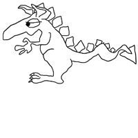

# python-paint
machine learning, computer vision and graphics for automating drawing and coloring

(in progress)

### DragonPaint 

##### current: 
This code is for a machine learning training set generator for style to style translation for automated coloring for animation. It uses component analysis and geometric relationships to automate training set generation for the colored version in sketch/colored pairs. After using components and "good" drawings to create pairs, we can create "bad" drawings with colored mates to add to the training set by e.g. erasing parts of lines in a drawing and pairing it with the colored version generated before the erasing, taking a good drawing and it's colored mate and cropping/rescaling so they break the rule that the background must be bigger than the body or taking a drawing we couldn't completely automate (e.g. part of an ear didn't get colored) and fix that one detail. Ideally, almost no painting will have to be done by hand for the estimated 400-1000 training pairs we need to follow Isola, et. al.

##### upcoming: 
I'll attempt additional work to reduce the number of sketches that have to be drawn by hand for reliable coloring, with a goal of 50 or fewer drawings and no manual coloring (or just one to specify the pattern). Then I'll combine Pix2Pix, tensorflow and component analysis to color dragon sketches according to a set pattern. After that, I'll work on the subject identification problem - knowing the difference between a dragon and a flower and coloring accordingly.

### other planned and existing python-paint functionality:
2. Red Ball - machine learning - use Pix2Pix (see Image-to-Image Translation with Conditional Adversarial Networks, Isola, et. al., https://github.com/phillipi/pix2pix), tensorflow to color balls red
3. DONE Sunflower Paint - use component analysis to color sketched flowers
4. Mathematical Daisy - create and paint families/varieties of cartoon flowers using parameters, parameterized curves and intersections of regions
5. Pattern Maker - machine learning - do something like PaintsChainer https://github.com/pfnet/PaintsChainer to take hint of user's paint scribbles and extrapolate to a layered "wallpaper" pattern to color a circle (center of flower) with
6. Experiment with CV and machine learning including contour tracing, texture analysis, image moments, edge detection, pattern recognition, classification

    a. Is It Zebra - LBP texture mapping
    
    b. Color quantiztion - k-means clustering
